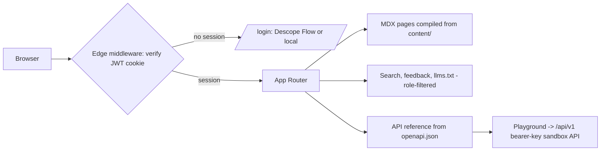
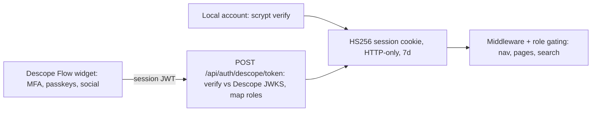

# Smilify Docs

Our self-hosted documentation platform — the internal replacement for Mintlify.
Built, verified end-to-end, and live on `main`.

`Next.js 14 · TypeScript` · `26 doc pages · 5 API endpoints` · `Descope SSO` · `100% self-hosted`

## What we built

Everything the docs experience needs, behind our own auth. Mintlify-compatible:
existing Mintlify content migrates by copying `docs.json` and moving MDX files
into `content/`.

- **MDX authoring** — frontmatter, GFM, and the full component library:
  callouts, cards, tabs, accordions, steps, fields, frames, code groups.
- **`docs.json` navigation** — tabs, groups, branding colors, navbar, footer;
  same schema shape as Mintlify.
- **Code blocks** — Shiki highlighting with dual light/dark themes, filename
  titles, line highlighting, copy buttons.
- **⌘K search** — fuzzy, typo-tolerant full-text search, filtered server-side
  by the viewer's role.
- **API reference** — pages generated from the OpenAPI spec: params,
  responses, code samples, and a live "Try it" playground.
- **Auth everywhere** — Descope SSO + local break-glass accounts. Every route
  (pages, search, `llms.txt`) requires a session.
- **Role-gated content** — admin-only nav groups vanish for members; direct
  URLs 404; search results filtered before leaving the server.
- **Reading experience** — dark mode, TOC scroll-spy, breadcrumbs, prev/next,
  feedback widget, responsive mobile nav, `llms.txt`.

## Architecture

> **There is no database. Git is the datastore.** Content, navigation, and the
> API spec are files in the repo; publishing is a git push. Sessions are
> stateless signed cookies. Search is an in-memory index rebuilt from content.
> Nothing to migrate, back up, or scale — the only mutable state is an
> append-only feedback log.

### The stack, layer by layer

| Layer | Technology | Why |
| --- | --- | --- |
| Framework | Next.js 14 (App Router) + React 18 + TypeScript | Server-rendered pages, edge middleware, one deployable unit |
| Content | MDX files + `gray-matter` + `next-mdx-remote` | Docs-as-code; compiled server-side per request, so edits are live without rebuilds |
| Highlighting | Shiki via `rehype-pretty-code` | GitHub-quality tokens, both themes emitted in one pass |
| Search | MiniSearch, in-memory index | No search service to run; role filtering applied at query time on the server |
| Sessions | HS256 JWT cookies (`jose`), HTTP-only | Stateless — no session store; verified at the edge on every request |
| Identity | Descope Flow (`@descope/react-sdk`) + scrypt local fallback | MFA/passkeys/social configured in the Descope console, zero code here |
| API reference | `openapi/openapi.json` → generated pages + playground | Spec changes are live instantly; playground hits the in-app API at `/api/v1` |
| Feedback | Append-only JSONL on disk | The one write path; swappable for an analytics pipeline |

### Where state lives

| State | Store | Durability |
| --- | --- | --- |
| Docs content, nav, OpenAPI spec | Git repository (files) | Versioned forever; deploys are git deploys |
| User sessions | Signed JWT in the browser cookie | Stateless; 7-day expiry; revoked by rotating `SESSION_SECRET` |
| Search index | Server memory | Rebuilt from content on boot — nothing to persist |
| API sandbox data | Server memory | Seeded on boot, resets on restart — by design for demos |
| Page feedback | `data/feedback.jsonl` | Append-only file; mount a volume or ship to analytics |

### Request path

Every request passes the session guard:



### Sign-in

Both paths mint the same first-party session:



## Mintlify parity matrix

Also lives in the product at `/platform/mintlify-parity`. Summary: core
platform and auth are at or beyond parity — and self-hosted, which Mintlify
can't offer. The AI layer is the open gap.

**✅ built · 🟡 partial · ❌ not built**

### Authoring & content

| Mintlify feature | Status | Notes |
| --- | --- | --- |
| MDX pages + frontmatter | ✅ | `content/**/*.mdx` |
| `docs.json` config (tabs, groups, colors, navbar, footer) | ✅ | Same schema shape — near copy-paste migration |
| Nav anchors / dropdowns / deep nesting | 🟡 | Tabs + groups today |
| Component library | ✅ | Callouts, cards, tabs, accordions, steps, fields, frames, updates, tooltips |
| Code blocks (highlighting, titles, line marks, copy, groups) | ✅ | Shiki, dual themes |
| Reusable snippets | ❌ | MDX include mechanism |

### Site experience

| Mintlify feature | Status | Notes |
| --- | --- | --- |
| Theming, dark mode, ⌘K search, TOC, breadcrumbs, prev/next, feedback, mobile | ✅ | Search is role-filtered server-side |
| Custom domains / hosting / CDN | 🟡 | Self-hosted: any internal domain, but we operate it |
| SEO tooling | 🟡 | Meta only — the site is auth-walled by design |

### API reference

| Mintlify feature | Status | Notes |
| --- | --- | --- |
| OpenAPI-generated reference pages | ✅ | One frontmatter line per endpoint |
| Interactive playground | ✅ | Live requests against `/api/v1` |
| Generated code samples | 🟡 | cURL / Python / JS; Mintlify ships more languages |
| AsyncAPI | ❌ | |

### AI & agents

| Mintlify feature | Status | Notes |
| --- | --- | --- |
| `llms.txt` | ✅ | Role-aware, auth-walled |
| `llms-full.txt` | ❌ | Hours of work |
| Raw-Markdown serving for agents | ❌ | Easy (`.md` routes) |
| Auto-generated MCP server | ❌ | ~1 day: search + fetch tools over content |
| Embedded AI assistant with citations | ❌ | 1–2 days on internal Claude API |
| Docs agent proposing updates ("self-updating") | ❌ | See verdict below |
| AI traffic analytics | ❌ | |

### Editing & workflow

| Mintlify feature | Status | Notes |
| --- | --- | --- |
| Docs-as-code (git-native) | ✅ | Arguably stronger — the site *is* the repo |
| WYSIWYG web editor | ❌ | Largest gap for non-technical editors |
| Preview deployments per PR | ❌ | Straightforward CI work |

### Enterprise

| Mintlify feature | Status | Notes |
| --- | --- | --- |
| Authentication | ✅ | Beyond parity: every route auth-walled, self-hosted, Descope SSO |
| Partial auth (public + private mix) | 🟡 | Role-gating yes; no anonymous tier |
| Personalization (per-user API keys) | 🟡 | Role-based content yes; playground key static |
| Versioning | ❌ | |
| Localization / translations | ❌ | |
| Analytics dashboard | ❌ | Feedback captured as JSONL |

## The verdict on "self-updating documentation for agents"

- **"Agents build on it" — half true today.** Docs are plain MDX in git (any
  coding agent can read and edit them — it's how this platform was built)
  plus a role-aware `llms.txt`. The rest of the agent-readiness layer —
  `llms-full.txt`, raw Markdown serving, MCP server, embedded assistant — is
  a 2–4 day roadmap, not built yet.
- **"Self-updating" — true for the API reference only.** It regenerates from
  the OpenAPI spec on every request: spec changes are live instantly with
  zero doc edits. Prose does not update itself. The credible path: a CI job
  running a coding agent on merge to draft doc-update PRs — the git-native
  design is already the right shape for it.

## Running it

```bash
npm install
npm run dev        # http://localhost:3000

# production
SESSION_SECRET=$(openssl rand -hex 32) npm run build && npm start
```

**Sign-in** — two methods, both ending in the same session cookie:

- **Descope SSO**: set `DESCOPE_PROJECT_ID` (see `.env.example`) and add the
  deployment origin to the Descope project's approved domains. Descope roles
  in `DESCOPE_ADMIN_ROLES` (default `admin, docs-admin`) grant docs admin.
- **Local accounts (break-glass)**: directory in `lib/auth.ts`, scrypt-hashed
  — `shaumik@echelonai.com` (admin), `guest@echelonai.com` (member).
  Passwords were shared out-of-band; rotate via `/admin/user-management`.

**Live demo script**: auth wall → sidebar/search/dark mode → Components
section → API playground (real `201`, clear key for `401`) → sign in as
member to show role gating → `/llms.txt`.
