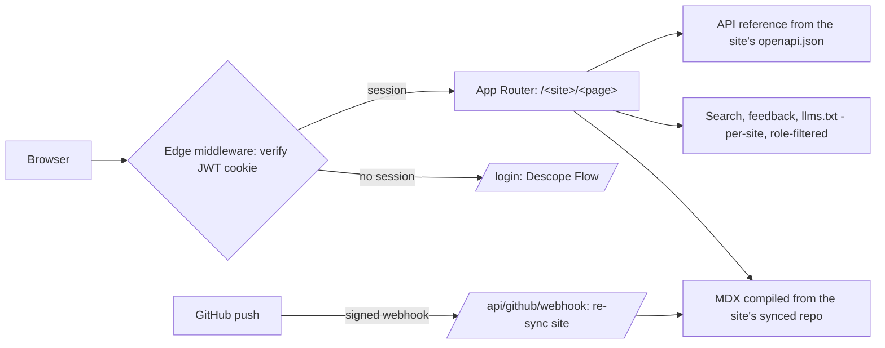
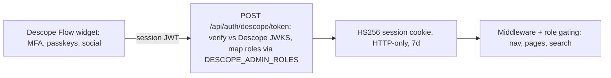

# Smilify

Our self-hosted documentation **platform** — the internal replacement for
Mintlify. Like Mintlify, the platform is separate from the content: install
the GitHub App, connect any repository from the admin dashboard, and it
becomes a docs site at `/<slug>`, re-synced on every push. The platform's own
manual ships as the built-in `docs` site.

`Next.js 14 · TypeScript` · `Multi-site: one deployment, many repos` · `GitHub App + webhook sync` · `Descope SSO` · `Agent-native (llms.txt · .md · MCP)` · `100% self-hosted`

## What we built

Everything the docs experience needs, behind our own auth. Mintlify-compatible:
an existing Mintlify repo connects as-is — `docs.json` plus MDX pages in
`content/`.

- **Connected repos** — each GitHub repo you connect is its own docs site with
  its own navigation, branding, search index, API reference, and agent
  surfaces. Auth is a GitHub App (short-lived read-only tokens, no PATs);
  a push webhook re-syncs the site in seconds.

- **MDX authoring** — frontmatter, GFM, and the full component library:
  callouts, cards, tabs, accordions, steps, fields, frames, code groups.
- **`docs.json` navigation** — tabs, groups, branding colors, navbar, footer;
  same schema shape as Mintlify.
- **Code blocks** — Shiki highlighting with dual light/dark themes, filename
  titles, line highlighting, copy buttons.
- **⌘K search** — fuzzy, typo-tolerant full-text search, filtered server-side
  by the viewer's role.
- **API reference** — pages generated from the OpenAPI spec: params,
  responses, code samples, and a live "Try it" playground.
- **Auth everywhere** — Descope SSO is the only sign-in path (no password
  form, no credential store in the repo). Every route requires a session;
  agents use a bearer token.
- **Role-gated content** — admin-only nav groups vanish for members; direct
  URLs 404; search results filtered before leaving the server.
- **Reading experience** — dark mode, TOC scroll-spy, breadcrumbs, prev/next,
  feedback widget, responsive mobile nav, `llms.txt`.

## Architecture

> **There is no database. Git is the datastore.** Every docs site is a git
> repo; publishing is a git push. Connected repos are shallow clones under
> `data/repos/`, refreshed by the GitHub webhook; the site registry is one
> JSON file. Sessions are stateless signed cookies. Search is an in-memory
> index per site. Nothing to migrate, back up, or scale beyond a data volume.

### The stack, layer by layer

| Layer | Technology | Why |
| --- | --- | --- |
| Framework | Next.js 14 (App Router) + React 18 + TypeScript | Server-rendered pages, edge middleware, one deployable unit |
| Content | MDX files + `gray-matter` + `next-mdx-remote` | Docs-as-code; compiled server-side per request, so edits are live without rebuilds |
| Highlighting | Shiki via `rehype-pretty-code` | GitHub-quality tokens, both themes emitted in one pass |
| Search | MiniSearch, in-memory index | No search service to run; role filtering applied at query time on the server |
| Sessions | HS256 JWT cookies (`jose`), HTTP-only | Stateless — no session store; verified at the edge on every request |
| Identity | Descope Flow (`@descope/react-sdk`) — sole sign-in path | MFA/passkeys/social and role assignment all live in the Descope console |
| API reference | `openapi/openapi.json` → generated pages + playground | Spec changes are live instantly; playground hits the in-app API at `/api/v1` |
| Feedback | Append-only JSONL on disk | The one write path; swappable for an analytics pipeline |

### Where state lives

| State | Store | Durability |
| --- | --- | --- |
| Docs content, nav, API specs | Git repositories (the connected repos) | Versioned forever; publishing is a push |
| Site registry (connected repos) | `data/sites.json` | One small file; mount `data/` as a volume |
| Synced repo copies | `data/repos/<slug>` shallow clones | Rebuilt from GitHub on demand — disposable |
| User sessions | Signed JWT in the browser cookie | Stateless; 7-day expiry; revoked by rotating `SESSION_SECRET` |
| Search index | Server memory | Rebuilt from content on boot — nothing to persist |
| API sandbox data | Server memory | Seeded on boot, resets on restart — by design for demos |
| Page feedback | `data/feedback.jsonl` | Append-only file; mount a volume or ship to analytics |

### Request path

Every request passes the session guard:



### Sign-in

Descope-only — roles come from Descope claims:



## Mintlify parity matrix

Also lives in the product at `/platform/mintlify-parity`. Summary: at or
beyond parity across authoring, API reference, AI/agents, and auth — and
self-hosted, which Mintlify can't offer. Remaining gaps: WYSIWYG web editor and
translations.

**✅ built · 🟡 partial · ❌ not built**

### Authoring & content

| Mintlify feature | Status | Notes |
| --- | --- | --- |
| MDX pages + frontmatter | ✅ | `content/**/*.mdx` |
| `docs.json` config (tabs, groups, colors, navbar, footer) | ✅ | Same schema shape — near copy-paste migration |
| Nav anchors, nested groups, version dropdown | ✅ | Global anchors, recursive sub-groups, versioning |
| Component library | ✅ | Callouts, cards, tabs, accordions, steps, fields, frames, updates, tooltips |
| Code blocks (highlighting, titles, line marks, copy, groups) | ✅ | Shiki, dual themes |
| Reusable snippets | ✅ | `<Snippet file="…" />` from `content/snippets/` |

### Site experience

| Mintlify feature | Status | Notes |
| --- | --- | --- |
| Theming, dark mode, ⌘K search, TOC, breadcrumbs, prev/next, feedback, mobile | ✅ | Search is role-filtered server-side |
| Custom domains / hosting / CDN | 🟡 | Self-hosted: any internal domain, but we operate it |
| SEO tooling | 🟡 | Meta only — the site is auth-walled by design |

### API reference

| Mintlify feature | Status | Notes |
| --- | --- | --- |
| OpenAPI-generated reference pages | ✅ | One frontmatter line per endpoint |
| Interactive playground | ✅ | Live requests against `/api/v1` |
| Generated code samples | ✅ | cURL, Python, JavaScript, TypeScript, Go, Rust |
| AsyncAPI | ✅ | `asyncapi/asyncapi.json` → generated event pages |

### AI & agents

| Mintlify feature | Status | Notes |
| --- | --- | --- |
| `llms.txt` / `llms-full.txt` | ✅ | Role-aware; agent bearer-token auth |
| Raw-Markdown serving for agents | ✅ | Any page at `/<slug>.md` |
| Auto-generated MCP server | ✅ | `POST /api/mcp`: search_docs, read_page, list_pages |
| Embedded AI assistant with citations | ✅ | Ask AI — Claude-backed, search-grounded (`ANTHROPIC_API_KEY`) |
| Docs agent proposing updates ("self-updating") | ✅ | Claude Code in CI opens doc-sync PRs on merge |
| AI traffic analytics | ✅ | Agent-classified logging + admin dashboard |

### Editing & workflow

| Mintlify feature | Status | Notes |
| --- | --- | --- |
| Docs-as-code (git-native) | ✅ | Arguably stronger — every site *is* a repo |
| GitHub App: connect any repo, sync on push | ✅ | Admin dashboard at `/docs/admin/sites`; webhook re-sync |
| Multiple docs sites per deployment | ✅ | Each repo serves at `/<slug>` with its own branding and search |
| WYSIWYG web editor | ❌ | The one remaining gap for non-technical editors |
| Preview deployments per PR | ✅ | CI: build + link check + preview deploy hook + PR comment |

### Enterprise

| Mintlify feature | Status | Notes |
| --- | --- | --- |
| Authentication | ✅ | Beyond parity: every route auth-walled, self-hosted, Descope SSO |
| Partial auth (public + private mix) | 🟡 | Role-gating yes; no anonymous tier |
| Personalization (per-user API keys) | 🟡 | Role-based content yes; playground key static |
| Versioning | ✅ | Version dropdown filtering navigation |
| Localization / translations | ❌ | |
| Analytics dashboard | ✅ | `/admin/analytics`: traffic, searches, agents, feedback |

## "Self-updating documentation for agents" — now true

- **Agents build on it.** Per-site `llms.txt` + `llms-full.txt`, every page
  as raw markdown at `/<site>/<page>.md`, one MCP server at `/api/mcp`
  spanning every connected site, bearer-token auth for agents
  (`DOCS_AGENT_TOKEN`), and an embedded Ask AI assistant.
- **Self-updating.** The API reference regenerates from the OpenAPI spec on
  every request, and `.github/workflows/docs-agent.yml` runs Claude Code on
  each merge to propose doc-sync PRs for prose. Humans approve every change.
  (CI workflows exercise only in GitHub Actions with repo secrets set —
  validate on the first real merge.)

## Running it

```bash
npm install
npm run dev        # http://localhost:3000

# production
SESSION_SECRET=$(openssl rand -hex 32) npm run build && npm start
```

**Sign-in is Descope-only** — no password form, no credential store in the
repo. Set `DESCOPE_PROJECT_ID` (see `.env.example`) and add the deployment
origin to the Descope project's approved domains; without it the login page
shows a setup notice and nobody can sign in.

**Roles** come from Descope claims: any Descope role listed in
`DESCOPE_ADMIN_ROLES` (default `admin, docs-admin`) grants docs admin;
everyone else who can sign in is a member. `DESCOPE_ADMIN_EMAILS`
force-grants admin for bootstrapping the first admin. Assign roles in the
Descope console (Users → assign role); they apply on next sign-in.

**Connecting repos**: create a GitHub App (Contents: read-only; push webhook
→ `/api/github/webhook`), set `GITHUB_APP_ID` / `GITHUB_APP_PRIVATE_KEY` /
`GITHUB_WEBHOOK_SECRET`, install it on your repos, then connect them from
**Connected repos** (`/docs/admin/sites`). Full guide: the
`admin/connecting-repos` page in the built-in docs.

**Live demo script**: auth wall → sidebar/search/dark mode → Components
section → API playground (real `201`, clear key for `401`) → connect a repo
live at `/docs/admin/sites` → push to it and watch the site update → sign in
with a non-admin Descope user to show role gating → `/docs/llms.txt`.
